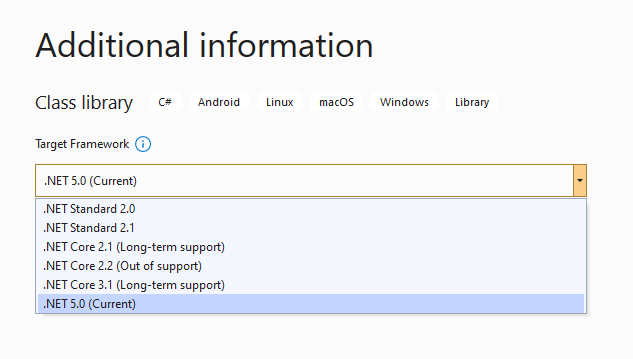
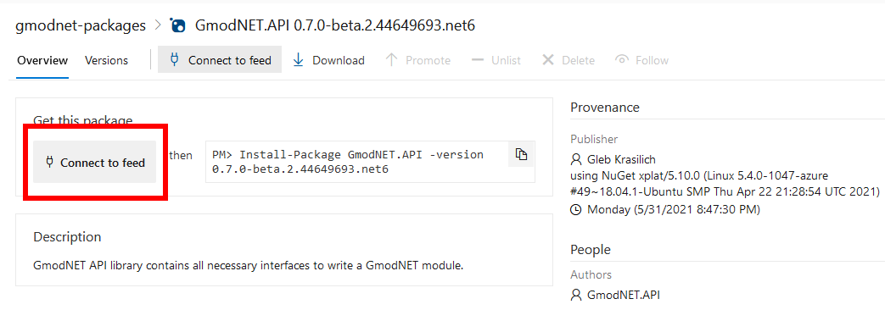
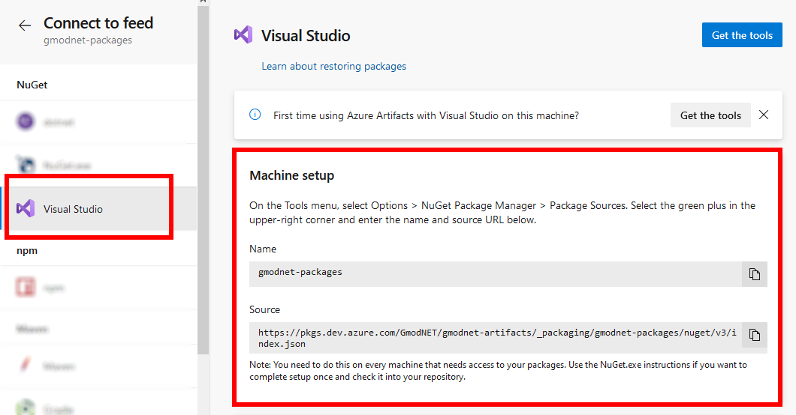
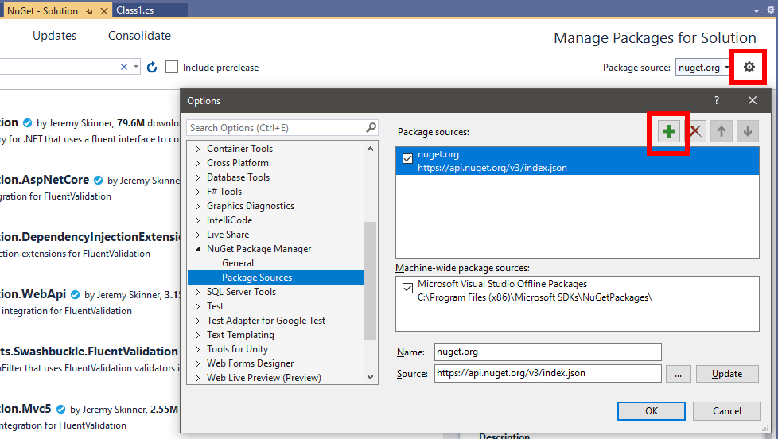
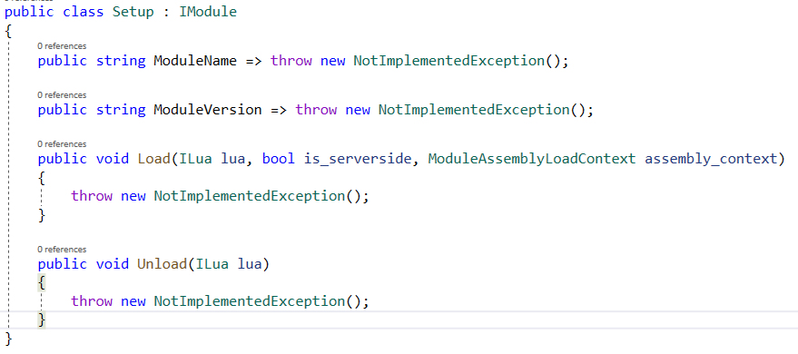

> [!WARNING]
> The nightly builds can be unstable. Please help us find bugs by [reporting issues on GitHub](https://github.com/GmodNET/GmodDotNet/issues).

# Connect to the nightly builds and use it in your project
Connect to the latest version of Gmod.NET to use the newest features (`main` for `.NET 5.0`) or to test the `.NET 6.0 Preview` version on the `net6` branch.

We'll create a project to test if we've got the latest version.

## Requirements

* [Visual Studio 2019](https://visualstudio.microsoft.com/)
   * Ensure at least these individual components are installed:
      * .NET SDK
      * NuGet Package manager
      * `.NET 5.0` if you want to use the nightly `main` branch
* The `.NET 6.0 Preview` [(link)](https://dotnet.microsoft.com/download/dotnet/6.0) if you want to use the nightly `net6` branch.
* Windows 10 (For more see the [Visual Studio requirements](https://docs.microsoft.com/en-us/visualstudio/releases/2019/system-requirements#visual-studio-2019-system-requirements))
* An internet connection

## Start a .NET project

To test if we've got a working nightly version we'll create a test project.

1. Start Visual Studio 2019
2. Create a new project and solution
3. When asked to pick a framework choose:
    * For the `net6` branches choose `.NET 6.0`
    * In our case we'll go for the `main` branch which is built for `.NET 5.0`

## Adding the nightly builds to NuGet

1. In the [Gmod.NET README](https://github.com/GmodNET/GmodDotNet#nightly-builds) there is [a link to the nightly builds](https://dev.azure.com/GmodNET/gmodnet-artifacts/_packaging?_a=feed&feed=gmodnet-packages)
2. Click *GmodNET.API*:

3. Click *Connect to feed*:

4. Note the *Source* link and name from the instructions:

5. In Visual Studio open the NuGet Package Manager:

6. Click the cog-wheel at the top right behind the default package source:

7. Click the green plus and enter the *Name* and *Source* you found at the nightly feed instructions (step 4).
8. Close these settings with OK.
9. Now select the newly added package source:

10. Ensure *Include prerelease* is selected
11. Click GmodNET.API and install the version you'd like to use.

## Test installation

1. Implement the IModule interface. (Add `: IModule` behind the class name)
    * **Note** you can have Visual Studio implement the interface through the *See potential fixes* option that appears when you hover over the IModule error.
2. Check the code generates to this result:

3. Build the project. If you get no errors you followed the instructions correctly and can now use the nightly builds.

## Install the module in Garry's Mod

To use our module we need to install the same built version of Gmod.NET to Garry's Mod.

1. Go to [https://nightly.gmodnet.xyz/](https://nightly.gmodnet.xyz/)
2. Download the pre-built version of Gmod.NET that you selected in NuGet earlier
3. Install it in Garry's Mod `lua/bin`

**You can now install your own .NET modules to `lua/bin/Modules` and load them in Garry's Mod**