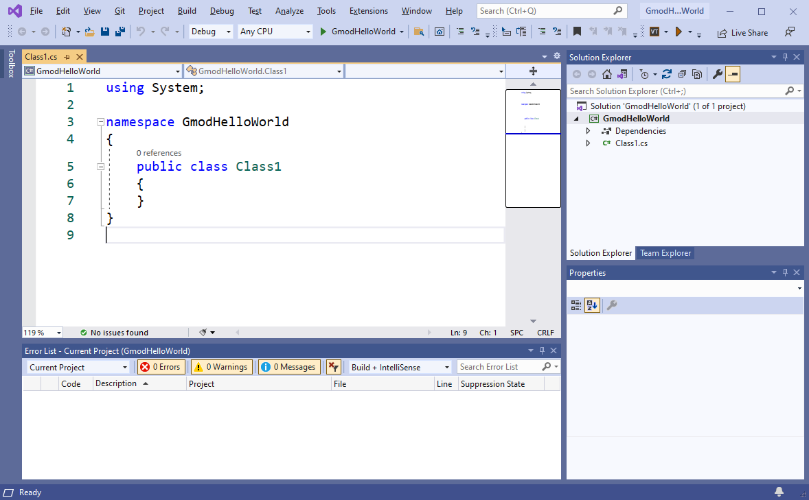
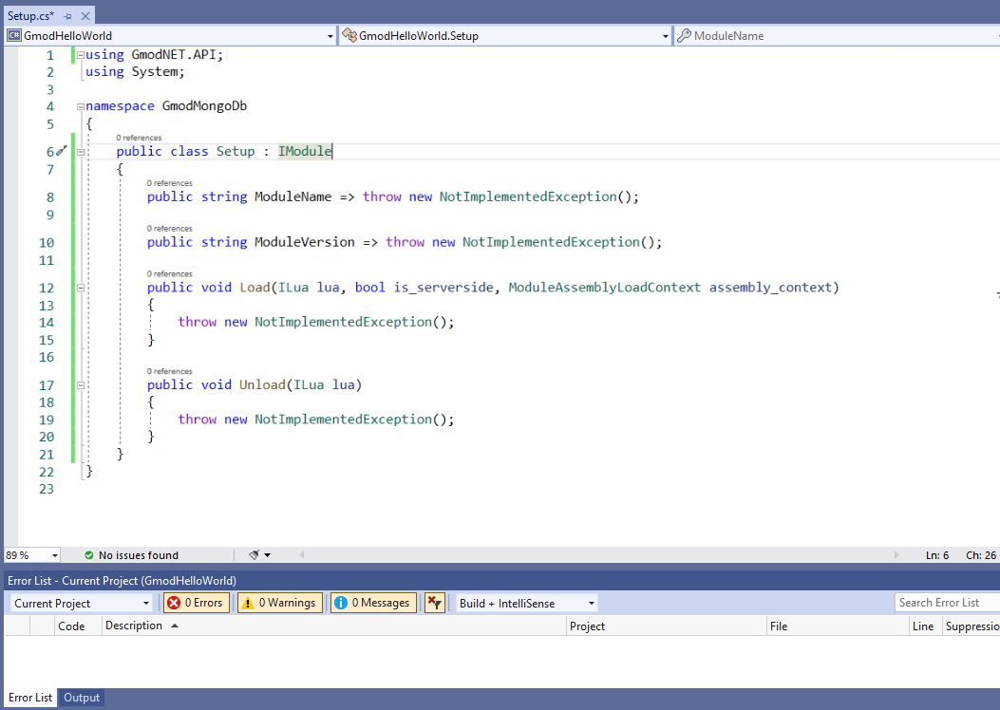
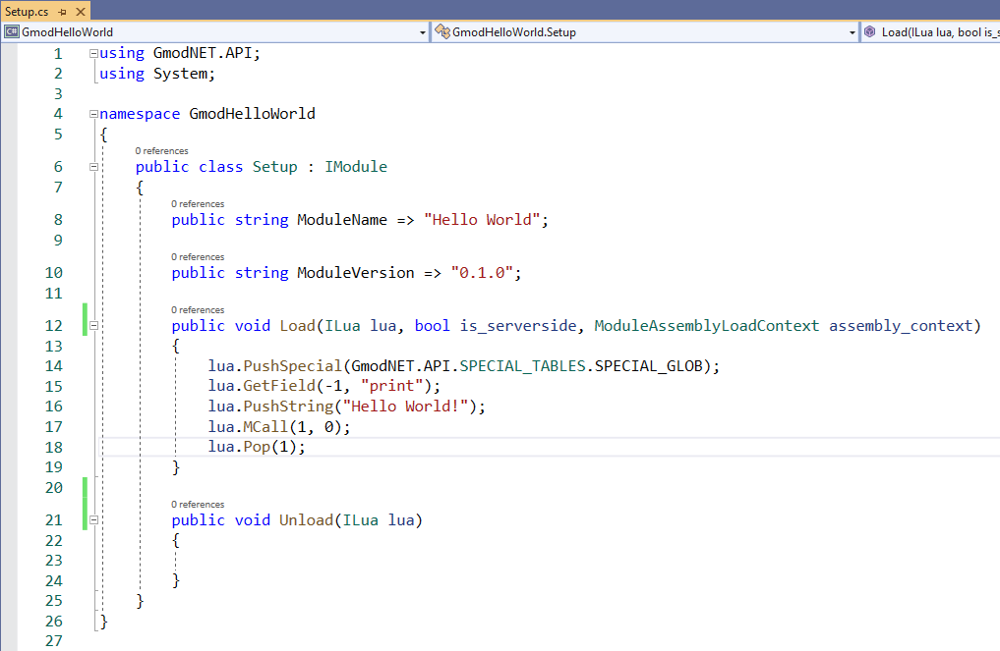
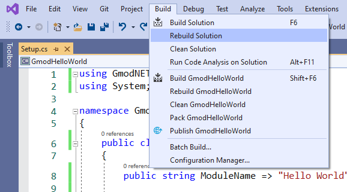
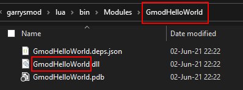
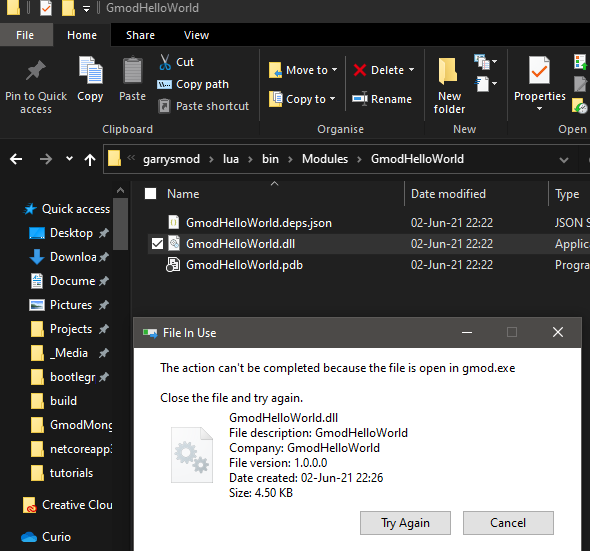

# A quick start with 'Hello World'
At the end of this tutorial you will have created and installed your own module that simply states: 'Hello World!' in the console. We will write our module using a bit of C# (pronounce C-Sharp) code.


## Requirements

* [Visual Studio 2019](https://visualstudio.microsoft.com/)
   * Ensure the *.NET desktop development Workload* is installed in Visual Studio
   * Ensure at least these individual components are installed:
      * .NET SDK
      * NuGet Package manager
      * C# and Visual Basic
      * .NET Core 3.1 Runtime (LTS)
* Windows 10 (8.1 and 7 SP1 may also work, see [Visual Studio requirements](https://docs.microsoft.com/en-us/visualstudio/releases/2019/system-requirements#visual-studio-2019-system-requirements))
* An internet connection
* A copy of [Garry's Mod installed through Steam](https://store.steampowered.com/app/4000/garrys_mod)
* Approximately half an hour of your time and patience *(including downloading and installing Visual Studio)*


## Preparations

1. Make sure you are on the Garry's Mod `x86-64` Beta branch
2. Install Gmod.NET in Garry's Mod following [the instructions in the README](https://github.com/GmodNET/GmodDotNet#installation-and-usage)


## Tutorial Overview

These are the subjects we will be discussing in order to create our **.NET Core** module, written in **C#**, that will simply print 'Hello World!' to the console:

1. Creating a Gmod.NET module project
   * Choosing the project type *Class Library (.NET Core)*
   * Including the GmodNET.API *NuGet Package* into our project
2. Setting up the basic code structure
   * Implementing the GmodNET.API *IModule Interface*
3. Writing module code
   * Printing 'Hello World' to the console
4. Building, installing and testing our module

**Let's get started!**


## 1. Creating a Gmod.NET module project

1. Start Visual Studio 2019
2. Click the **Create new project** option
3. Click the project type **Class Library (.NET Core)** *(Use the search box to find it faster)*
   * **Note:** Is this project type missing? Double-check that you installed the .NET desktop development workload and the other required components.


4. Click Next or double-click the project type
5. Choose the project name "GmodHelloWorld" *(the naming convention is PascalCase/UpperCamelCase)*
6. Click Next 
7. As the Target Framework choose:
   * If you're using a release like `0.6.0` use at least: **.NET Core 3.1 (Long-term support)** 
   * If you're using a nightly build use at least: **.NET 5.0**

Visual Studio will generate a Class Library (.NET Core) project for us. When it's done you will see this screen:

 

8. Go to View and click **Error List**. This will help us find problems with our code later. You only have to do this once.

**Let's add the GmodNET.API NuGet package to our project.** 

9. In the toolstrip Go to **Tools > NuGet Package Manager > Manage NuGet Packages for Solution...**


10. Go to the **Browse** tab
11. In the search bar search for "GmodNET.API"
12. Click **GmodNET.API**
13. On the right-hand side check the box in front of your project name (GmodHelloWorld)
14. Click Install. It may take a second to download and install. VS2019 will say **Ready** in the bottom left when it's done doing whatever it's doing.

**We have now created an empty project with which we can start making Gmod.NET modules.** You will repeat this chapter every time you wish to create a new Garry's Mod module.


## 2. Setting up the basic code structure

1. **Right-click Class1.cs** in the Solution Explorer

2. Click **Rename** and let's give this file a better name *(read on below this image)*

   

3. We will name the file "Setup.cs". *(the file name convention is UpperCamelCase with no spaces, nor any special characters)*

4. **Always click yes** when you get the dialog asking you *"Would you like to rename all references from Class1 to Setup?"*. 


**We will now write our first code, instructing Gmod.NET that this code file is a module.**

5. Put your cursor behind `public class Setup` and type: ` : IModule`

*Check that you've written the code exactly (with a capital I and capital M) like in this screenshot:*


Visual Studio thinks it can even help us with  this error. It's saying **Show potential fixes** and in this case one of the suggestions actually makes sense. *(These suggestions can be wrong sometimes, you can't fully rely on it)*

6. Click **Show potential fixes**

7. Now click the top option **using GmodNET.API;**

   **Note:** If this option is missing then verify you installed the GmodNET.API NuGet package.


The suggestion to add `using GmodNET.API;` adds that same line of code to the top of our file.

Let Visual Studio help us *implement the IModule interface* (= to add the functionalities that the interface wants us to add):

8. Hover your cursor over the error at IModule
9. Select **Show potential fixes**
10. Choose the suggestion **Implement interface**


The generated code shows us how we can implement our interface. The clear names for these functionalities also show us what we need to do and how we need to fill it in.



Let's go over the generated code, step-by-step and fill in the "empty spots".

11. First fill the ***Property*** `ModuleName` with our module name:

    

12. Next fill the *Property* `ModuleVersion` with a version like "0.1.0". 

The **load**-***method*** is called when our module is loaded. We will fill it with code in the next chapter.

The **Unload-*method*** is called when our module needs to clean up after itself. Unload is irrelevant for our Hello World example.

13. Remove `throw new NotImplementedException();` from both the Load and Unload methods:


That's it! We've setup our code and are ready to get to the main subject of today: making our module print 'Hello World!'.


## 3. Writing module code

After all those instructions we finally get to the most important part of this module: actually printing 'Hello World!' to the Garry's Mod console.

1. First copy the following code inside the Load method **between the curly brackets**:

   ```lua
   lua.PushSpecial(GmodNET.API.SPECIAL_TABLES.SPECIAL_GLOB);
   lua.GetField(-1, "print");
   lua.PushString("Hello World!");
   lua.MCall(1, 0);
   lua.Pop(1);
   ```

2. Confirm the entire code file `Setup.cs` looks like this:



The code we just added to the Load method will be executed when Gmod.NET loads our module. The code simply prints the string "Hello World!" to the Garry's Mod console. We use the Lua `print` function to achieve this.

**For more information on the Hello World code you copied check out: <xref:tutorial_hello_world_detailed>.**


## 4. Building, installing and testing our module

### Building

1. In the toolstrip go to Build and click **Rebuild Solution**. This will package our module ready for redistribution.



2. Go to your solution location in Windows File Explorer.

3. Inside your solution navigate to where the module was built: `<your solution location>\GmodHelloWorld\bin\Debug\netcoreapp3.1\`

4. If your module built successfully you'll have the following files. We'll call these "*the built module files*".


### Installing

1. Open another File Explorer window and go to your Garry's Mod folder and then `garrysmod\lua\bin\Modules`.
   * **Note:** If you don't see a *bin* folder in the lua folder, create it. If you don't see a *Modules* folder inside the bin folder, create it.

2. ****Create a folder inside `garrysmod\lua\bin\Modules` with the exact name of your module. In our case we name the folder GmodHelloWorld.**

3. Copy all *the built module files* to the folder we just created at `garrysmod\lua\bin\Modules\GmodHelloWorld\`:



**The module is now installed and Gmod.NET should be able to find it.**

### Testing

1. Start Garry's Mod

2. Start a singleplayer game

3. Check the console. Because we're loading the module in Singleplayer it's loaded clientside, our "Hello World!" message will appear in a yellow color:

 

**🎉 Yay! Success!** We've created a .NET module for Garry's Mod.


### Testing

You'll have to rebuild and reinstall the module when you make changes in C#.

1. When you reinstall the module (by copying it to: `lua/bin/Modules/GmodHelloWorld/`) you may get this error. That's because the module is in use while playing:



2. Unload the module:
   * To unload the module use `gmod_net_unload_all` for the server
   * In our case we yse `gmod_net_unload_all_cl` to unload the module clientside (because we're in singleplayer)


3. Now that the module is unloaded you can overwrite it with the new files.

4. Reload it with `gmod_net_load_all` or `gmod_net_load_all_cl` for server and client respectively.

